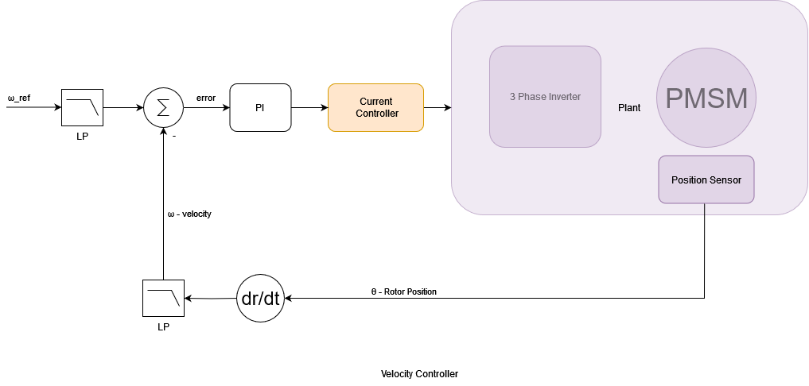

# ToolboxR 📖

> [!WARNING] 
> This project is currently a work in progress. 

## 1. Motor Controller

In this discussion, our primary focus is on the speed and torque control of the motor. 

Position control intricately ties to trajectory generation techniques and other methods. These methods and techniques have been, or will be, elaborated upon in other sections of the **RToolbox**.

To control the speed of motor, we employ a classic cascading approach utilizing two PI controllers:

- The **Inner Loop** (Torque/Current Controller): It acts swiftly against disturbances, primarily targeting measurable facets of the system. In this context, it serves as a torque or current controller. It's important to note that torque is directly proportional to current. This loop's main goal is to adjust rapidly without any overshoot.
  
- The **Outer Loop** (Speed Controller): It manages the motor's velocity, operating slower than the inner loop. When a setpoint, like a reference motor speed, is defined for this loop, its output cascades as the setpoint for the inner loop (indicative of the desired torque). This hierarchical structure endows the system with faster responses and heightened resilience against disturbances.

Both loops are equipped with a Proportional-Integral (PI) controller, which incorporates a Low Pass (LP) filter at its input.

## Tuning Process

1. **Inner Loop Tuning**: Prioritize the inner loop by tuning it to be both swift and stable, ensuring no overshoots.
2. **Outer Loop Tuning**: Once the inner loop is optimized, the outer loop is calibrated to achieve the desired response.

Each PI controller has distinct Proportional and Integral gains. The meticulous tuning of these gains is imperative for the system's optimal performance.

